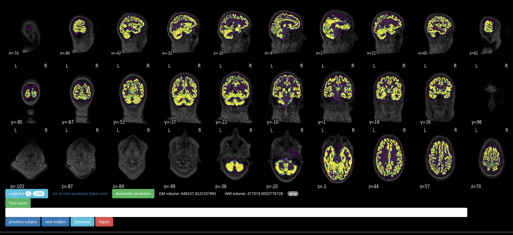
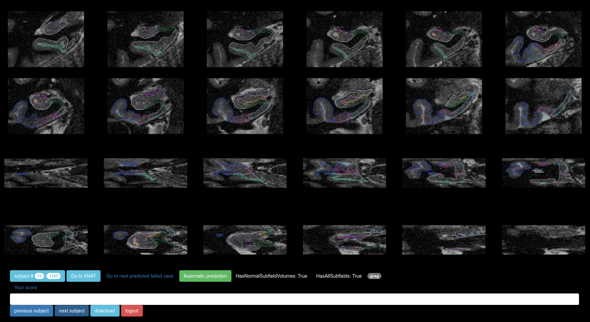

# snaprate

Make it easier to collect quality control scores from a panel of experts.

The tool works as a web application where experts can review snapshots across subjects.
Users may start a session on the system using individual login/password opening a
browser to the local network address where the server is running.

Once the server is running, users may log in using their
attributed credentials to start their review from the main screen:

- Buttons `previous subject`/`next subject` are used to navigate through the
different snapshots. As a result, the subject's identifier gets
 incremented/decremented. Any given ID may be accessed through direct URL:
 `<host>:<port>?id=<ID>` (ex: *localhost:8888?id=42*).

- Button `Your score` is for the user to review the current snapshot. Clicking on
it multiple times would turn it from not rated to green, then red, then orange,
then back to not rated. The text box located just under this button is for
potential comments. To save your review, just move on to the following/previous
subject.

- Each snapshot comes with an automatic prediction for quality, reflected by the
color (green or red) of the `Automatic prediction` button. The link located on
the left next to this button allows to skip to the next predicted failed case.
On the right is displayed information regarding volumes of gray and white
matter.

- User reviews are systematically and automatically stored server-side.
Nevertheless, button `download` allows to save them locally in an Excel table.

## Usage:

- **Server-side**:
  - place a collection of snapshots in `$PATH/web/data/` (Note: follow the
    structure of the default folder provided)
  - run the web server (`python $PATH/snaprate/server.py`)

- **Client-side**: open a browser pointing to the server address (and defined
  port (default:8890))

**Note:** this code was initially written to allow comparisons across different
methods over a group of subjects. For this kind of application, please refer to the
branch named [`hipposeg_comparison`](https://github.com/xgrg/snaprate/tree/hipposeg_comparison).

## Dependencies:

- tornado
- pandas

## Live action

